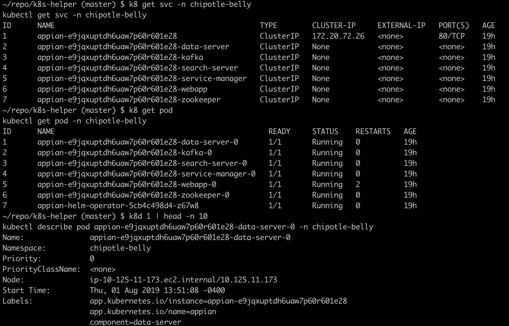

# kubectl helper scripts

## Install

```
git clone git@github.com:dannylee-/k8s-helper.git
./k8s-helper/install.sh
source ~/.bash_profile
```

## Scripts

```k8``` - Basically, it's kubectl except it will remember your last used namespace and it will give you an additional ID column when using "k8 get" calls

```k8d <ID>``` - Gets the details of one of the items listed in the last "k8 get" call

```k8e <ID>``` - Edits the resource of one of the items listed in the last "k8 get" call

```k8get <ID>``` - Get the resource of one of the items listed in the last "k8 get" call.  This can be used in conjuction with "-oyaml" or "-o=jsonpath="

```k8exec <ID> <COMMAND>``` - kubectl exec into one of the pods listed in the last "k8 get" call

```k8ssm <ID>``` - SSM into the host node for one of the pods listed in the last "k8 get" call

```k8log <ID>``` - kubectl log into one of the pods listed in the last "k8 get" call.  This can be used in conjunction with "-f" to tail the logs or "-c" to choose a specific container

```k8del <ID>``` - Delete one of the items listed in the last "k8 get" call

## Example

